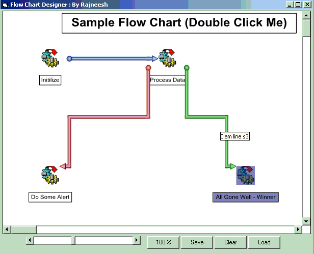



## Flow Chart Designer

### Description

Flow Chart designer is used to design 3d Flow charts like in SQL Server DTS Package.Where you have some nodes as tasks or connection, and line connecting task as workflow order.You may put some labels on your chart and adjust lot of properties ( OutLines,Transparency etc) to adjust the label objects.You can move various objects and zoom in or zoom out the graph.You can also save or load the graph as flat file or in database.
 
### More Info
 
Install Graph.ocx from oGraph\Bin\Graph.ocx

if this is not in the package then you need to compile Graph.vbp

Run the wrapper.exe or Wrapper.vbp

Please don't forget to vote for this code as your comments motivates to put more valuable codes

             |
---                |---
**Submitted On**   |2006-09-13 02:30:36
**By**             |[Rajneesh Noonia](https://github.com/Planet-Source-Code/PSCIndex/blob/master/ByAuthor/rajneesh-noonia.md)
**Level**          |Advanced
**User Rating**    |4.8 (63 globes from 13 users)
**Compatibility**  |VB 6\.0, ASP \(Active Server Pages\) 
**Category**       |[Custom Controls/ Forms/  Menus](https://github.com/Planet-Source-Code/PSCIndex/blob/master/ByCategory/custom-controls-forms-menus__1-4.md)
**World**          |[Visual Basic](https://github.com/Planet-Source-Code/PSCIndex/blob/master/ByWorld/visual-basic.md)
**Archive File**   |[Flow\_Chart2019559132006\.zip](https://github.com/Planet-Source-Code/rajneesh-noonia-flow-chart-designer__1-66543/archive/master.zip)

